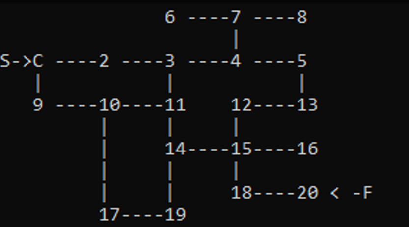
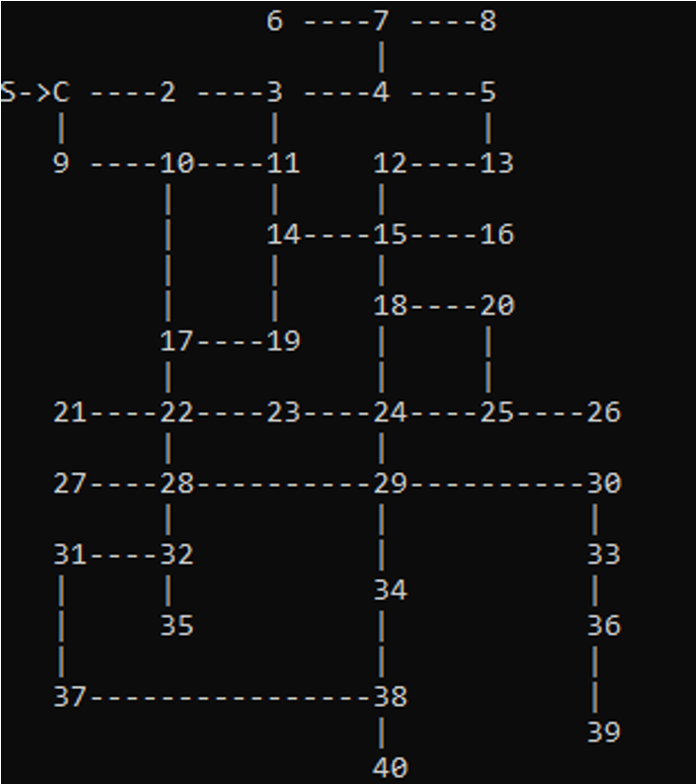

# Maze Racing Game

## About

Maze Racing Game is a console-based game developed in **C++** that demonstrates the practical use of graph theory, data structures, and Dijkstra's shortest path algorithm. The game allows players to manually navigate through maze levels or automatically find the shortest path to the destination.

## Developer

**Kashaf Fatima**
Software Engineer

---

## Features

* Manual and Automatic gameplay modes
* Two maze levels
* Graph-based map representation
* Shortest path calculation using Dijkstra's Algorithm
* Health and scoring system
* Random obstacles and bonus nodes
* Achievement collection
* Leaderboard and score history using file handling

---

## Gameplay

### Manual Mode

* Move through the maze using **W, A, S, D** keys.
* Start from Node **1** and reach the destination node.
* Avoid obstacles that reduce health.
* Collect achievements and maintain the highest score.

### Automatic Mode

* The game calculates the shortest path using **Dijkstra's Algorithm**.
* The optimal route is displayed automatically based on randomly assigned edge weights.

---

## Game Levels

* **Level 1:** 20 Nodes
* **Level 2:** 40 Nodes

### Level 1 Map



### Level 2 Map



---

## Data Structures and Algorithms

This project implements:

* Graph (Adjacency List)
* Linked List
* Queue
* Dijkstra's Algorithm
* File Handling
* Object-Oriented Programming (OOP)

---

## Project Structure

```text
Maze-Racing-Game/
│── main.cpp
│── Header.h
│── leaderboard.txt
│── scorehistorylv1.txt
│── scorehistorylv2.txt
└── images/
    ├── level1.png
    └── level2.png
```

---

## How to Run

1. Open the project in Visual Studio.
2. Build the project.
3. Run the executable.
4. Select a game mode and level from the menu.

---

## Technologies Used

* C++
* Visual Studio
* Windows Console API
* Graph Theory
* Data Structures
* Dijkstra's Shortest Path Algorithm

---

## License

This project was developed for educational purposes as part of a Software Engineering/Data Structures project.
